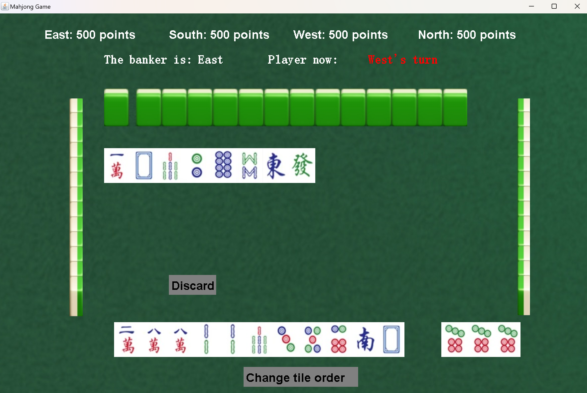

# Mahjong_COMP2008J

Welcome to Mahjong_COMP2008J, a geeky project that brings the classic game of Mahjong to your computer.
This project is the result of our hard work for the Software Engineering course at BDIC during the spring semester of our second year.

## Team Members
- [Le Liu](https://github.com/mrle0429)
- [Ziheng Wang](https://github.com/wangLyndon)
- [Sicheng Yi](https://github.com/CHENSHIYI14)
- [Kuize Lu](https://github.com/kaza34)
## Tech Stack

- Java
- IntelliJ IDEA
- TCP/IP and Sockets
- GitHub
- JUnit

## Installation and Running

To get this project up and running on your local machine, follow these steps:

1. Clone this repository to your local machine.
2. Open the project in IntelliJ IDEA.
3. Run `src/View/App.java`.

## Project Introduction

Mahjong_COMP2008J is a Beijing Mahjong game that can be played both offline and online.

In the offline version, four players share a single computer to play the game. This mode is perfect for friends or family who are in the same location and want to play a game together.

The online version allows four players to play the game on their own computers. This mode is great for players who are in different locations but still want to enjoy a game of Mahjong together.

Please note that our version of Mahjong does not currently support the wildcard feature. We welcome contributions from developers who are interested in adding this feature to our game.

## Game screenshots
**Main Menu**

**Help Menu**

**Gameplay**

# FAQ

# Contact Us
If you have any questions or suggestions, please feel free to contact us at [Le Liu](mailto:le.liu1@ucdconnect.ie)